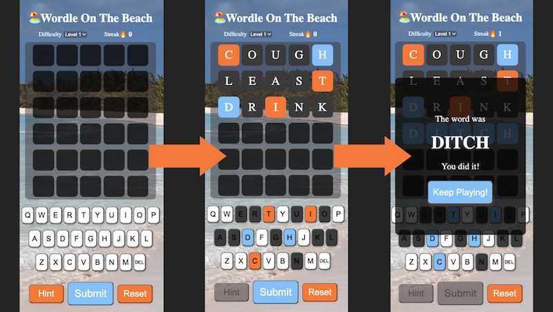

# Wordle On The Beach!

Want to improve your NY Times Wordle ability and skip the ads of those other apps? **Wordle On The Beach** is your training grounds. Nearly identical to both the paper-and-pen game Jotto from 1955 and the television game Lingo, players are given six chances to guess a five-letter secret word using only other five-letter English words. The goal is to take as few guesses as possible. Feedback is given to the player with each guessed word if any of the letters match those in the secret word (background changing to orange) and if the letter is in the same place in the secret word (background changing to blue). Both button presses and key presses are supported in **Wordle On The Beach**.

# **[Click Here To Play](https://wordle-on-the-beach.netlify.app/)**

# **Added Features:**
We've added a couple of features to help you develop your skills! 
* If your guess word isn't a five-letter word in English we'll let you know!

* Our streak system will help you keep track of how many secret words in a row you've revealed. No cheating and changing difficulty or resetting early!

* Our hint feature will give you a letter in the secret word if you haven't found it yet. Did it disappear with only four letters found? Watch out for words with double letters!

* Getting better? Increase the difficulty!

# **Technologies Used:**
* CSS
* JavaScript
* HTML
* Git

# **Attributions:**
- **Wordle On The Beach** uses the Open Sans Regular font created by Steve Matteson available from Google Fonts [Here](https://fonts.google.com/specimen/Open+Sans?query=open+sans)

# **Ice Box:**
- [ ] Add audio to letter inputs to guesses, submitted words, win/loss scenarios
- [ ] Add animation to letters revealed as included in secret word and correct position
- [ ] Add toggle for hints to increase challenge when turned off
- [ ] Add toggle for a timer to increase challenge/speed
- [ ] Adapt the streak system to a scoring system to incorporate how many guesses it took to find the secret word
- [ ] Add toggle for relaxing waves white noise background to help immerse the user in a beach environment
- [x] Animate or change the color of the hint revealed letter on the keyboard to more clearly communicate to the player
- [ ] Cache streak/score to allow continued play over multiple visits and store the highest streak/score attained
